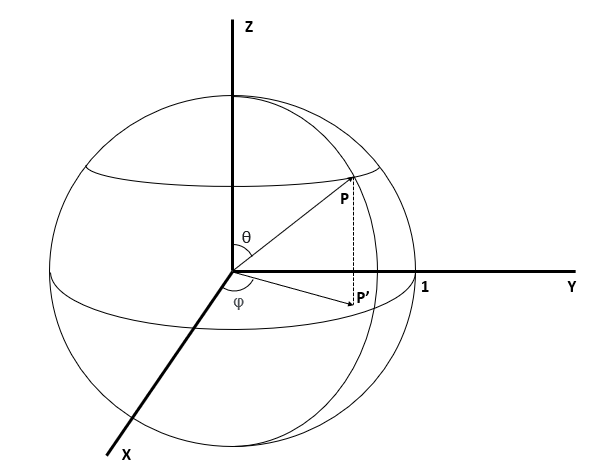
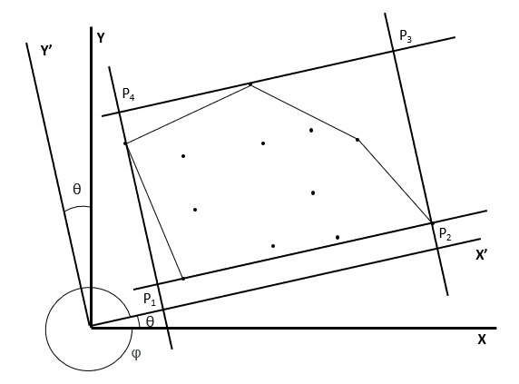

# **Polygons**

##### Author: Lopez, Santiago, Cégep de Sherbrooke, 2022

### _Who was this made for_
##### This program was designed to aid the study of light pollution, specifically the characterization of artificial light sources. However, individuals may find useful to reuse some parts of code for other projects.

### _What it does_
##### This program aims to fully automate the characterization of the height of light sources in a certain geographical area. It achieves this using the OSM overpass API, the Simplemaps World Cities database, the Google Street View Static API and trained image recognition Microsoft Lobe models. The result will be a certain number of spatial polygons, each containing the height of the light sources within that region.

### _How to download_
##### Use the following command in the command line:
	git clone https://github.com/SantiagoLopez012/Polygons
##### Note: it is important not to move any of the files for the script to function properly.

### _How to use it_
##### This script was designed with ease of use in mind. As such, only a small amount of work is required from the user. The program requires a Google Cloud API key, which can be obtained by following the steps documented at the following address: https://developers.google.com/maps/documentation/streetview/cloud-setup 

##### Afterwards, the user simply has to fill in the required information in the params.txt file, _i.e._ the API key, the directory in which the Street View images will be downloaded, the shape of the grid of polygons and the coordinates OR the name of the region.

##### During runtime, the user will have to approve the polygon and the shape, to ensure that no mistakes are made, as the process costs money.
##### Tip: if using this in the command line, a bug may occur when displaying the map in the browser. If this happens, closing all tabs in the browser and retrying seems to fix this issue. Alternatively, line 500 of the Polygons.py file may be commented out to bypass the verification process. If this is done, it is recommended to manually verify the polygon by copying the query at lines 150-153 and entering it at the following address: https://overpass-turbo.eu/
##### However, the result seen on this website will not be representative of the actual result, as the polygon is further modified in the script.

### _How it works_
##### 1. Using the overpass API, a polygon of the region to study is downloaded. Using the Simplemaps database, faraway results are eliminated. It is also possible to manually enter the polygon to study.

##### 2. A new polygon is created. This polygon is the smallest bounding box of the points defined in the first step. As this uses a planar approximation, the studied region must not be too big for it to work as intended.

##### 3. The polygon is then separated in m ⋅ n subzones, where every subzone will eventually contain the information regarding the height of the lamps. These subzones are saved in specific directories.

##### 4. For each subzone created previously, a Street View Static API request is made to download two images at the coordinates of the center point, one facing North and the other facing East.

##### 5. For each subzone, the Lobe models will analyze the images and determine the height of the lamps.

##### 6. A csv file containing an inventory is created from all the subzones. In subzones where no lamps were detected, the written height is that of the nearest subzone where a lamp was succesfully detected. If no lamps were detected at all, a warning is issued to the user.

### _Credits_
##### Simplemaps for providing the World Cities database under the Creative Commons Attribution 4.0 license (https://creativecommons.org/licenses/by/4.0/). No modifications have been made to the database, and the original can be found here: https://simplemaps.com/data/world-cities

### _License_
##### This work is distributed under the GNU General Public License v3.0 (https://www.gnu.org/licenses/gpl-3.0.html)

### _Results_
##### At the moment, the Lobe model which was trained to evaluate the height of the lamps has a low success rate. As such, before this script is ready for its intended use, the model will have to be trained further.

### _A more detailed look at some algorithms_
##### What follows is a brief explanation of some algorithms used in this program. 

##### 1. Algorithm to find the distance d between two points, R1 and R2, on the surface of a sphere

##### This algorithm makes use of basic linear algebra. The problem can be visualized in the following way, where the distance will be the product of the angle α and the radius.

##### To find α, we first define the position vectors of the projection of our points on the unit sphere. Since we use (lat,lon) coordinates, each position vector is defined the following way, where θ is the angle between the Z axis and vector P (complementary angle of the latitude) and φ is the angle between the X axis and the projection of vector P on the XY plane (the longitude).

##### We can then define the X, Y and Z components of vector P using the following formulas:
##### X = sin(θ) ⋅ cos(φ)
##### Y = sin(θ) ⋅ sin(φ)
##### Z = cos(θ)

##### We now have two unit vectors P1 and P2. We can find α and d with the following:
##### P1 ⋅ P2 = cosα
##### α = acos(P1 ⋅ P2)
##### d = r ⋅ α

##### 2. Algorithm to find the smallest bounding box

##### This algorithm finds the smallest rectangle which contains all of the points of a certain cloud.

##### First, we find the convex hull of the cloud.

##### Knowing that the smallest bounding box shares a side with the convex hull, we choose a side of the hull and create the smallest possible rectangle.

##### We now need to find the coordinates of the 4 points which define this rectangle. To do so, we find the angle θ between the side we chose and the X axis. This angle is determined by use of the arctangent on the slope.

##### We then rotate our coordinate system counter-clockwise by θ, which is equivalent to rotating our points counter-clockwise by φ.

##### To find the new coordinates of our points, we use the following formula:
##### (X', Y') = (X⋅cos(φ) - Y⋅sin(φ), X⋅sin(φ) + Y⋅cos(φ))

##### We now define the rectangle with the points (max(X'), max(Y')), (max(X'), min(Y')), (min(X'), min(Y')), (min(X'), max(Y')).
##### To find the smallest bounding box, we create all possible bounding boxes (one for each side of the convex hull) and choose the one with the smallest area.
